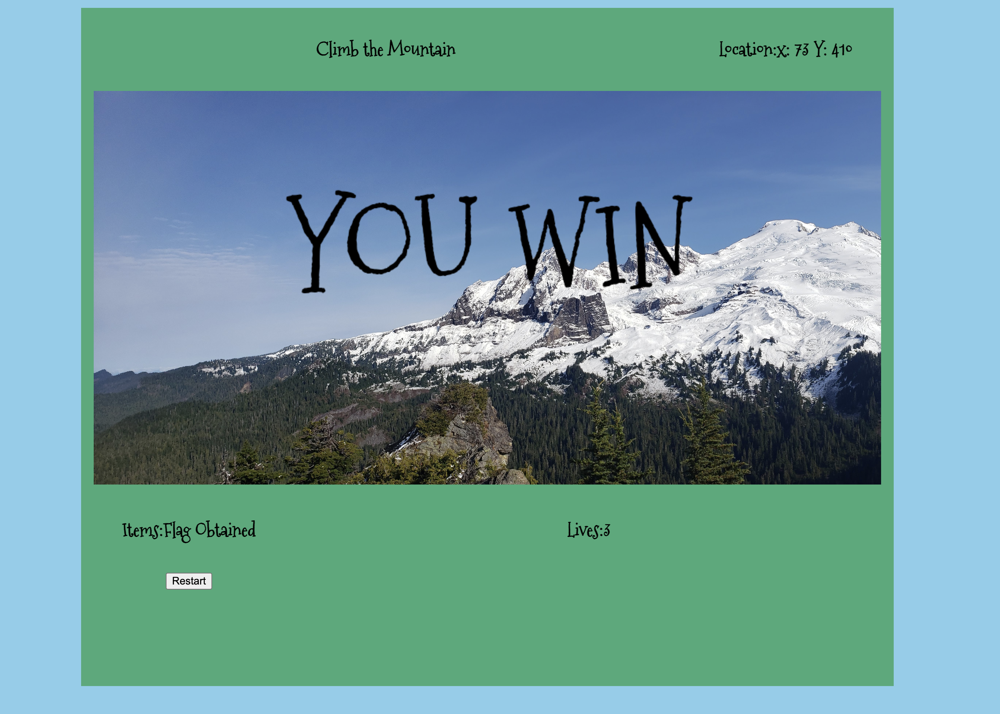
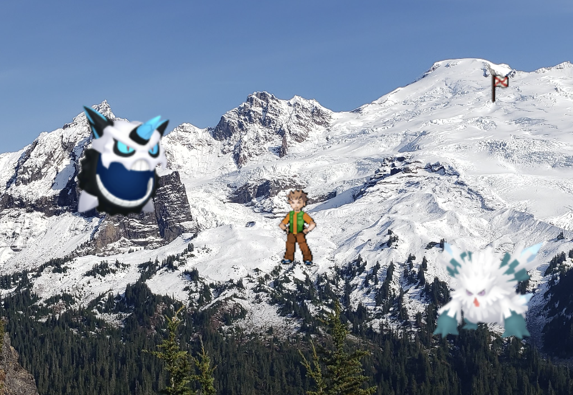
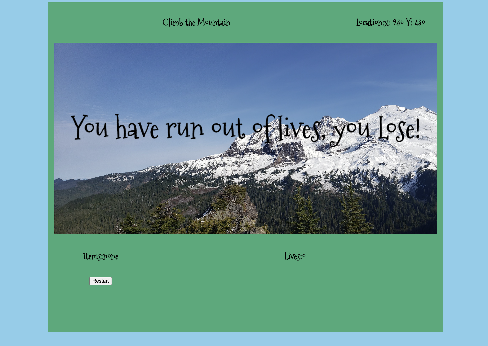

# Mountain-Climber

beginning of the game


After capturing the checkPoint


after returning to the victory flag => win


close up of the sprites

defeat -> run out of lives from hitting monsters


EXPLANATION OF TECHNOLOGIES
In this we are using classes to create the hero and 2 monsters using the Climber class. The checkpoint Flag and victory flag are created using the flag class. 
Utilizing 'keydown' we track keystrokes to move our hero to the checkpoint flag which then despawns and spawns the finish flag. Upon reaching that the game ends and victory is obtained.

Hit detection is used to track contact with the flags as well as the monsters. When our hero hits a monster they die and randomly respawn on the bottom of the map to try again. A life is taken away at this point.

INSTALLATION INSTRUCTIONS
Open the web page to begin playing. 
how to play:
Move the hero 'up' by using 'w' or 'UpArrow'
Move the hero 'left' by using 'a' or 'LeftArrow'
Move the hero 'down' by using 's' or 'DownArrow'
Move the hero 'right' by using 'd' or 'RightArrow'

APPROACH TAKEN:
I utilized a similar approach as our shrek crawler game.

CODE SNIPPETS: 

a sample of the code used to make things happen.
```function respawnHero() {
    hero.alive = false;
    let newLives = Number(lives.textContent) - 1;
    lives.textContent = newLives;
    hero = new Climber(heroRandomX, game.height - 70, heroImage, 64, 64);
    return true;
}``` used to respawn our hero upon contact with the monster while also removing 1 life counter and spawning a new hero.
```
function spawnFinishFlag() {
    checkPointFlag.exists = false;
    checkPointFlag.obtained = true;
    finishFlag = new Flag(50, game.height - 50, finishFlagImage, 25, 25);
    finishFlag.render();
}``` upon obtaining the checkPointFlag this will create our victory flag

```function youWin() {
    //victory condition
    finishFlag.exists = false;
    ctx.font = "150px Mountains of Christmas";
    ctx.textAlign = "center"
    ctx.fillText('YOU WIN', game.width / 2, game.height / 2);
}``` this will display our victory message in the middle of the canvas while clearing it.

```function youLose() {
    ctx.font = "75px Mountains of Christmas";
    ctx.textAlign = "center"
    ctx.fillText('You have run out of lives, you Lose!', game.width / 2, game.height / 2);
}```  activates when hero life count reaches zero thus activating defeat conditions.

```class Climber {
    constructor(x, y, image, width, height) {
        this.x = x;
        this.y = y;
        this.image = image;
        this.width = width;
        this.height = height;
        this.alive = true;

        this.render = function () {
            ctx.drawImage(this.image, this.x, this.y, this.width, this.height)
        }
    }
}
class Flag {
    constructor(x, y, image, width, height) {
        this.x = x;
        this.y = y;
        this.image = image;
        this.width = width;
        this.height = height;
        this.exists = true;
        this.obtained = false;

        this.render = function () {
            ctx.drawImage(this.image, this.x, this.y, this.width, this.height)
        }
    }
}``` the classes used to create our hero, monster and flags

UNSOLVED PROBLEMS:
[ ] getting 5 monsters to spawn upon capturing the checkpoint flag 
[ ] randomizing the monster movement

STRETCH GOALS
[ ] add music
[ ] animated sprites